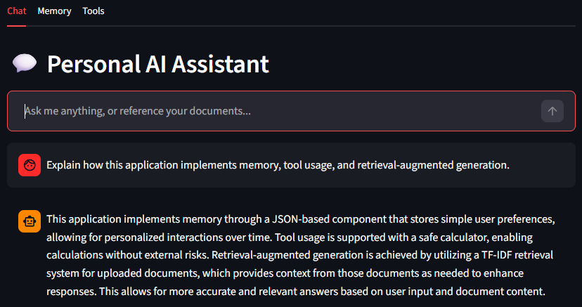
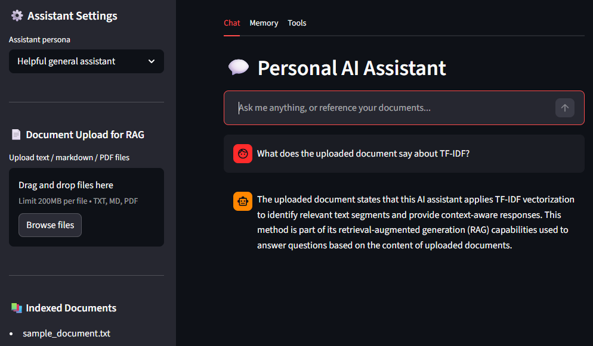
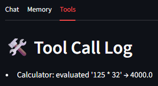
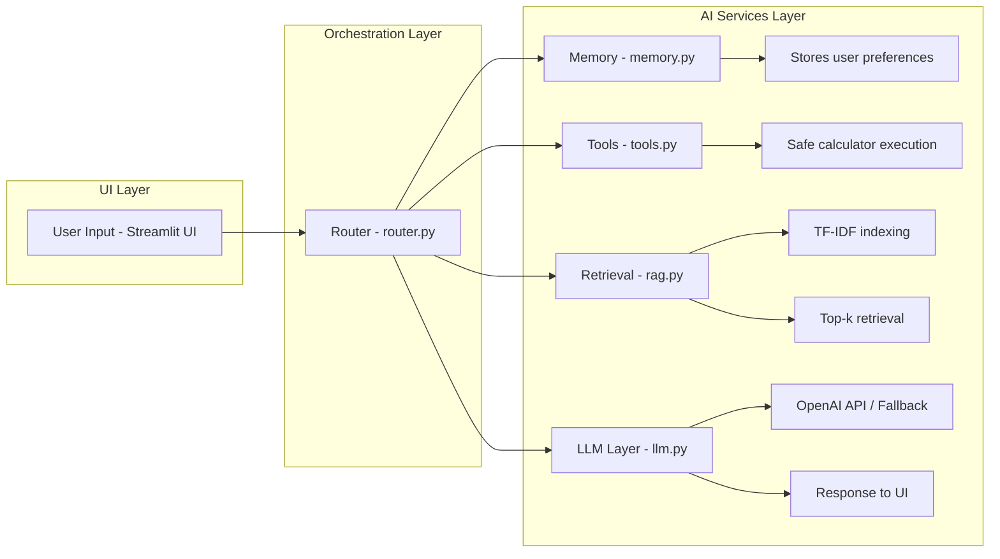

# Personal AI Assistant – RAG + Memory + Tools (Streamlit)


## 📸 Demo

### 💬 Chat Interface



### 📄 Document Upload & RAG



### 🛠 Tool Execution



---

## 📌 Overview

Personal AI Assistant is a modular AI application that combines document-aware question answering, lightweight long-term memory, and safe tool usage within a single Streamlit interface.

This project demonstrates practical AI engineering patterns including retrieval orchestration, modular system design, and tool-augmented reasoning.

It integrates the following core components:

- A chat-based interface built with Streamlit  
- Lightweight Retrieval-Augmented Generation (RAG) over uploaded documents  
- A simple long-term memory store for user preferences  
- Tool calling with a safe calculator and logging  
- A pluggable LLM backend (OpenAI) with a graceful no-API fallback  

---

## 🚀 Features

- **Chat UI** with multiple personas:
  - Helpful general assistant
  - Explain like I'm 12
  - Technical AI mentor
- **Document upload & RAG**:
  - Upload `.txt`, `.md`, `.pdf` files
  - Indexed using TF-IDF
  - Retrieve top relevant chunks when you ask questions
- **Long-term memory** (JSON-based):
  - Stores simple user preferences (e.g. "I prefer...")
- **Tool calling**:
  - Safe mathematical expression evaluation
  - Tool log view

The architecture is intentionally simple and transparent, so recruiters
can understand and extend it easily.

---

## 🌍 Real-World Use Cases

This system can be adapted for:

- Customer support assistants with document-based Q&A  
- Internal knowledge base search tools  
- Technical documentation assistants  
- Business intelligence copilots  
- Educational AI tutors with contextual understanding  

---

## 🧰 Tech Stack

**Core Technologies**
- Python
- Streamlit

**AI / Machine Learning**
- OpenAI API (LLM integration)
- TF-IDF Vectorization (scikit-learn)

**System Design**
- Modular architecture (UI, routing, services)
- Retrieval-Augmented Generation (RAG)

**Data & Storage**
- JSON-based memory store
- Local document indexing

**Tools & Safety**
- AST-based safe expression evaluation

---

## 📁 Project Structure

```text
personal-ai-assistant/
├── app.py                  # Streamlit front-end
├── assistant/
│   ├── __init__.py
│   ├── config.py           # Settings & OpenAI API key loader
│   ├── llm.py              # OpenAI chat wrapper + fallback
│   ├── rag.py              # TF-IDF RAG utilities
│   ├── memory.py           # JSON-based long-term memory
│   ├── tools.py            # Safe calculator tool
│   └── router.py           # Message routing & orchestration
├── data/
│   └── documents/          # Uploaded documents + TF-IDF index
├── requirements.txt
└── README.md
```

---

## ⚙️ Architecture

This architecture demonstrates a modular AI system design with clear separation between the UI, orchestration, and AI service layers.



---

### Component Responsibilities

- **Streamlit UI (`app.py`)**  
  Handles user interaction, persona selection, and document uploads  

- **Router (`router.py`)**  
  Orchestrates request flow between memory, retrieval, tools, and LLM  

- **Retrieval (`rag.py`)**  
  Performs TF-IDF indexing and retrieves relevant document chunks  

- **Memory (`memory.py`)**  
  Stores and retrieves simple long-term user preferences  

- **Tools (`tools.py`)**  
  Executes safe utility functions and logs tool usage  

- **LLM Layer (`llm.py`)**  
  Handles LLM interaction with a fallback mode when no API key is provided  

---

## 🔑 Setup

1. Create a virtual environment (recommended).

2. Install dependencies:

```bash
pip install -r requirements.txt
```

3. Set your OpenAI API key (required for live LLM responses):

```bash
export OPENAI_API_KEY="sk-..."
```

On Windows PowerShell:

```powershell
$env:OPENAI_API_KEY="sk-..."
```

> If OPENAI_API_KEY is not set, the system falls back
> to a safe local response mode (no external API calls).

---

## ▶️ Run the App

From the project root directory:

```bash
streamlit run app.py
```

Then open the URL shown in the terminal (typically http://localhost:8501).

---

## 🧪 How to Use

1. Select an assistant persona from the sidebar.
2. Upload one or more documents (`.txt`, `.md`, `.pdf`) for retrieval.
3. Ask questions in the Chat tab, such as:
   - "Summarize the key points from my documents."
   - "What does the uploaded document say about TF-IDF?"
   - "Explain the main idea like I'm 12."
4. Explore system features:
   - **Memory tab** → View stored user preferences  
   - **Tools tab** → Inspect tool execution logs  

---

## 🧱 Extensibility Notes (for Recruiters / Engineers)

- Swap TF-IDF + cosine similarity for deep embeddings (OpenAI, sentence-transformers, etc.).
- Replace local JSON memory with a database (SQLite, Postgres, Redis, etc.).
- Add new tools (e.g., web search, database queries, third-party APIs).
- Wrap the Streamlit app in Docker and deploy to cloud / Hostinger.

The codebase is kept small and well-documented to show clear reasoning
and solid engineering practices without unnecessary complexity.
